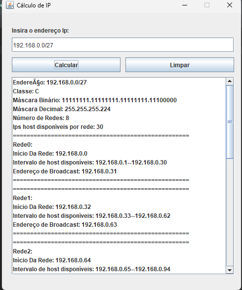

# CÁLCULO-IP

Projeto feito com objetivo de colocar em prática os conhecimentos das aulas de Lógica de Programação e IOT. O projeto desenvolvido calcula dados de um endereço IP, assim como os dados de sub-redes caso se aplique ao endereço de entrada.

## Tecnologias

* Java
* GIT

## Autor
[Enzo Carrilho](<https://www.linkedin.com/in/enzo-carrilho/>)